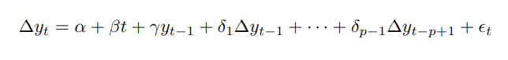
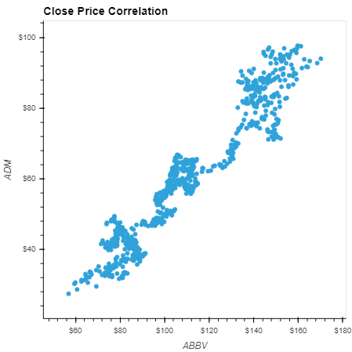
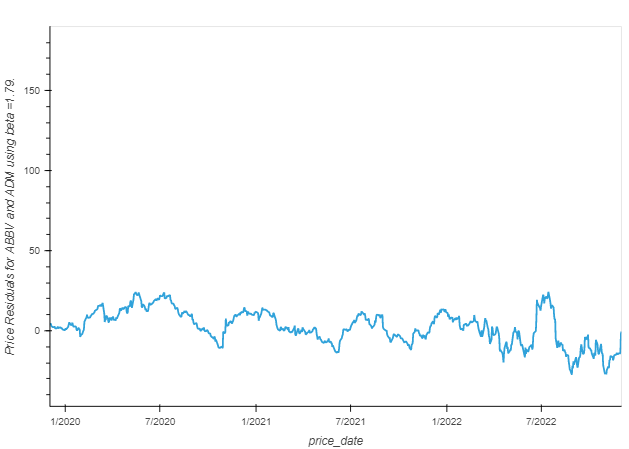
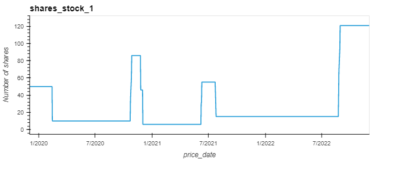

# APPLICATION OF PAIRS TRADING STRATEGY: A MACHINE LEARNING APPROACH

## Pairs Trading
A key quantitative trading concept is mean reversion – when a time series displays a tendency to revert to a historical mean value (see figure below).

:max_bytes(150000):strip_icc()/ImpliedVolatility_BuyLowandSellHigh2-2f5a33f6dde64c808b4d4775a258d3d7.png)

This is exploited to generate trading strategies as a trade can be entered when a price series is far from the mean. To assess if a time series is mean-reverting, a statistical test is performed to see if it differs from the behaviour of a random walk or Geometric Brownian Motion (GBM) random walk (figure below).

Mathematically, a mean-reverting time series is referred to as an Ornstein-Uhlenbeck process, and it has the differential equation:

If it can be shown statistically that a price series behaves like an Ornstein-Uhlenbeck series, then it will be possible to design a trading strategy around it. In this project, the Statsmodels python library is used to test for mean-reversion.

One such test is the Augmented Dickey-Fuller Test (ADF). A model for a time series known as a linear lag model of order p is shown below:

The change in the value of the time series is proportional to a constant, the current time and the previous p values of the time series, along with an error term. 

The role of the ADF hypothesis test is to check whether γ = 0, which would indicate (with α = β = 0) that the process is a random walk and thus non mean reverting. The test considers the null hypothesis that γ = 0.

Upon performing the test on a time series such as the random walks above, the  null hypothesis of γ = 0 cannot be rejected and thus the series is unlikely to be mean reverting. This is in line with intuition as most equities behave like to Geometric Brownian Motion (GBM) random walk
However, an alternative method for detecting mean-reversion can be implemented particularly via the concept of stationarity.

A time series (or stochastic process) is stationary if its joint probability distribution is invariant under translations in time or space.

It is difficult to find a tradable asset that possesses mean-reverting behaviour, as equities tend to behave like GBMs. However, we can create a portfolio of price series that is stationary.
The simplest form of mean-reverting trade strategies is the classic “pairs trade”, which usually involves a dollar-neutral long-short pair of equities.

Two companies in the same sector are likely to be exposed to similar market factors, thus exhibiting cointegration (see below). Occasionally their relative stock prices will diverge due to certain events that affect one but not the other and their price differences will eventually revert to the long-running mean.

The Cointegrated Augmented Dickey-Fuller Test (CADF) determines the optimal hedge ratio by performing a linear regression against the two time series and then tests for stationarity under the linear combination.

## Strategy Implementation
### Data import and storage
A database (securities_master) was created in PostgreSQL using the schema shown below:

The database included the four tables below:

* Symbol
* Daily Price
* Data vendor
* Exchange 

The list of all S&P500 tickers was obtained and downloaded to the the Symbol table using the ticker_fetch.ipynb, which uses bs4.BeautifulSoup(response.text) to convert table into text. The notebook price_import_to_db.ipynb imports daily prices for the last 3 years for all 503 tickers to the database via financialmodelingprep API.

All data was then accessible from the securities_master PostgreSQL database.

### Selection of trading pair 

All possible combinations for the top 20 tickers were assessed using the itertools library.

A CADF test for each of the ticker pairs' time histories was performed to assess cointegration.Next, the correlation and the corresponding hedge ratio for each pair of the cointegrated pairs was calculated.

The residuals for each pair were also calculated.

The highest correlated pair was selected as part of the strategy.

### Pairs Trade Strategy execution and assessment 
Mean-reversion of the residuals (+/1 1 std) was leveraged in the strategy creating signals to buy long (-1), sell short (1), or do nothing (0) for each TS in the pair.

To assess performance of the strategy a comparison was made against an original portfolio with 50 shares invested in each stock.

This baseline portfolio will not change number of shares.

In contrast, the strategy will sell/buy 40 shares from stock to the other based on the trading strategy. As shown below, the number of shares in each stock varies according to the strategy signals.

Performance was assessed by looking at the differences in equity curves and cumulative returns.

## ML Algorithms
Three ML classifiers were employed to help automate implementation of the pair trade strategy
1. Support Vector Classifier

2. Random Forest Classifier

3. Quadratic Discriminant Analysis

The three year price data for the pair was split into a training dataset and a testing dataset (1 yr and 2 yr, respectively).

Residual data were used as the single feature in the X dataframes, which scaled prior to use in the ML strategy.

Strategy signals were selected as the ML target values.

The training data was observed to be heavily imbalanced, so oversampling of the training set was employed.

### SVC Results

### RFC Results

### QDA Results

## Conclusions
As shown above the baseline strategy of pairs trading produces higher returns than the original pair portfolio (unchanged). 

The three ML algorithms follow the cumulative returns profile of the baseline strategy. However, RFC has a higher degree of accuracy (86%) in the triggering of trading signals than SVC and QDA (79% and 62% respectively). 